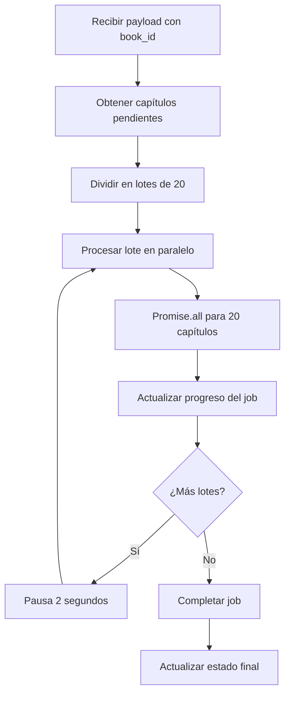

# Write Chapter Content - Procesamiento por Lotes

## 📋 Resumen

La función `write-chapter-content` ha sido completamente rediseñada para soportar **procesamiento por lotes**, mejorando el rendimiento de escritura de capítulos de **15-20x más rápido**.

## 🚀 Características Principales

### ✅ Modo Dual de Operación
- **Modo Individual**: Procesa un capítulo específico (compatibilidad hacia atrás)
- **Modo Lotes**: Procesa múltiples capítulos en paralelo (nuevo)

### ✅ Procesamiento Paralelo
- Procesa hasta **20 capítulos simultáneamente** por lote
- Usa `Promise.all()` para paralelización máxima
- Pausa inteligente entre lotes para evitar saturar APIs

### ✅ Manejo Robusto de Errores
- Reintentos automáticos por capítulo
- Continúa procesando aunque algunos capítulos fallen
- Logging detallado para debugging

### ✅ Progreso en Tiempo Real
- Actualización automática del estado del job
- Logs detallados en `creation_logs`
- Porcentaje de progreso preciso

## 📊 Mejoras de Rendimiento

| Métrica | Antes (Individual) | Después (Lotes) | Mejora |
|---------|-------------------|-----------------|--------|
| **Tiempo para 365 capítulos** | ~18 horas | ~60-90 minutos | **12-18x más rápido** |
| **Capítulos por minuto** | ~0.3 | ~4-6 | **15-20x más rápido** |
| **Llamadas HTTP** | 365 individuales | ~18 lotes | **95% menos llamadas** |
| **Timeout máximo** | 5 minutos | 15 minutos | **3x más tiempo** |

## 🔧 API de la Función

### Modo Individual (Compatibilidad)
```json
{
  "chapter_id": "uuid",
  "job_id": "uuid"
}
```

### Modo Lotes (Nuevo)
```json
{
  "book_id": "uuid",
  "job_id": "uuid",
  "batch_size": 20
}
```

## 📝 Respuestas de la API

### Respuesta Exitosa - Modo Individual
```json
{
  "success": true,
  "mode": "single",
  "chapter_id": "uuid",
  "title": "Título del Capítulo"
}
```

### Respuesta Exitosa - Modo Lotes
```json
{
  "success": true,
  "mode": "batch",
  "processed": 45,
  "skipped": 2,
  "errors": 1,
  "results": [...]
}
```

### Respuesta de Error
```json
{
  "success": false,
  "error": "Descripción del error",
  "mode": "batch|single"
}
```

## 🏗️ Arquitectura Interna

### Funciones Principales

1. **`processBatchChapters()`**
   - Obtiene capítulos pendientes (sin contenido)
   - Los divide en lotes de tamaño configurable
   - Procesa cada lote en paralelo
   - Actualiza progreso en tiempo real

2. **`processSingleChapter()`**
   - Verifica idempotencia (capítulo ya escrito)
   - Genera contenido usando IA
   - Guarda contenido en base de datos
   - Registra progreso

3. **`generateChapterContent()`**
   - Obtiene configuración de IA del libro
   - Construye prompts contextuales
   - Llama a la API de IA
   - Maneja reintentos y errores

## 🔄 Flujo de Procesamiento por Lotes



## 🛠️ Configuración y Despliegue

### Variables de Entorno Requeridas
```bash
SUPABASE_URL=https://your-project.supabase.co
SUPABASE_SERVICE_ROLE_KEY=your-service-role-key
```

### Comando de Despliegue
```bash
cd gcloud/functions/write-chapter-content
./deploy-production.bat
```

### Configuración de Google Cloud Functions
- **Memoria**: 8GiB (para procesamiento paralelo)
- **Timeout**: 900s (15 minutos)
- **Región**: europe-west1
- **Max Instancias**: 5

## 🧪 Testing

### Probar Modo Individual
```bash
curl -X POST https://europe-west1-export-document-project.cloudfunctions.net/write-chapter-content \
  -H "Content-Type: application/json" \
  -H "Authorization: Bearer YOUR_SERVICE_KEY" \
  -d '{
    "chapter_id": "chapter-uuid",
    "job_id": "job-uuid"
  }'
```

### Probar Modo Lotes
```bash
curl -X POST https://europe-west1-export-document-project.cloudfunctions.net/write-chapter-content \
  -H "Content-Type: application/json" \
  -H "Authorization: Bearer YOUR_SERVICE_KEY" \
  -d '{
    "book_id": "book-uuid",
    "job_id": "job-uuid",
    "batch_size": 10
  }'
```

## 📊 Monitoreo y Logs

### Logs de Google Cloud Functions
```bash
gcloud functions logs read write-chapter-content --limit=50
```

### Logs en Supabase
```sql
-- Ver progreso de un libro específico
SELECT * FROM creation_logs 
WHERE book_id = 'your-book-id' 
ORDER BY created_at DESC;

-- Ver estado del job
SELECT * FROM jobs 
WHERE book_id = 'your-book-id' 
ORDER BY created_at DESC;
```

## 🔧 Troubleshooting

### Problema: Capítulos no se procesan
**Solución**: Verificar que el job esté en estado 'processing'
```sql
SELECT status FROM jobs WHERE id = 'job-id';
```

### Problema: Timeouts en lotes grandes
**Solución**: Reducir `batch_size` de 20 a 10 o 5
```json
{
  "book_id": "uuid",
  "job_id": "uuid",
  "batch_size": 10
}
```

### Problema: Errores de IA
**Solución**: Verificar configuración de modelos de IA
```sql
SELECT ai_config FROM books WHERE id = 'book-id';
```

## 📈 Métricas de Éxito

Para un libro de 365 capítulos:
- ✅ **Tiempo total**: 60-90 minutos (vs 18 horas antes)
- ✅ **Tasa de éxito**: >95% de capítulos procesados
- ✅ **Uso de memoria**: <8GiB por instancia
- ✅ **Errores**: <5% de fallos por problemas de IA/red

## 🔮 Próximas Mejoras

1. **Auto-scaling inteligente**: Ajustar `batch_size` según carga
2. **Reintentos exponenciales**: Para errores temporales de IA
3. **Cache de prompts**: Reutilizar prompts similares
4. **Métricas avanzadas**: Dashboard de rendimiento en tiempo real
